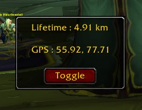
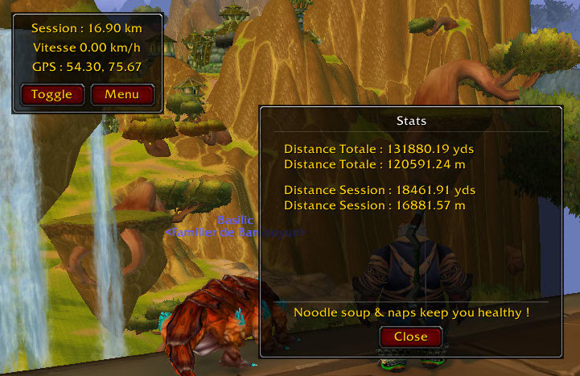
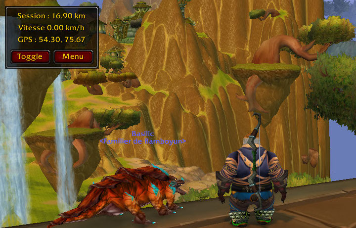

# Feet Of Azeroth

A small travel companion for Azeroth. Display your current coordinates and track the distance you've travelled through the world of Warcraft.

## Features

  
  
  

* Display of the player's current coordinates
* Distance travelled during the current session
* Total distance travelled since the addon was installed
* Switch between meters and yards

## Sources

* https://wowpedia.fandom.com/wiki/Speed
* https://warcraft.wiki.gg/wiki/Movement

