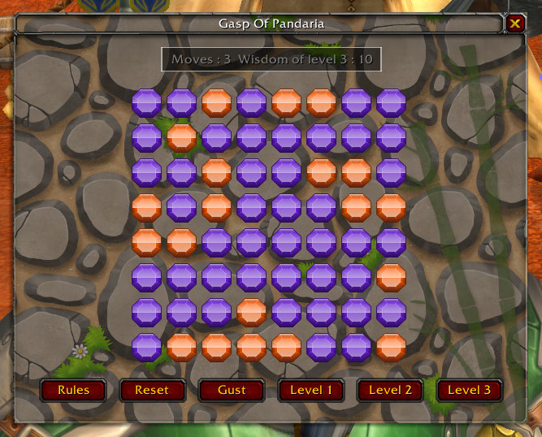
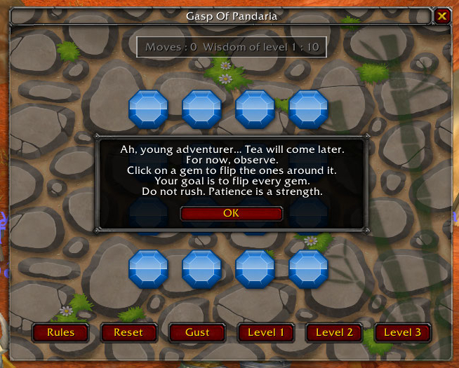
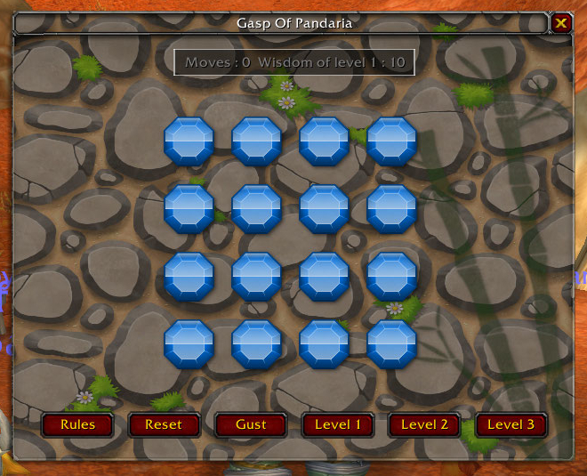

# 🌿 Gasp of Pandaria

**Gasp of Pandaria** is a light and relaxing mini‑game inspired by the calm aesthetics of Pandaria. It features a simple 4×4 puzzle grid designed for quick, enjoyable sessions between quests, dungeons, or raids.

Click on a gem to flip the ones around it.  
Your goal is to flip every gem.

## Development notice

The versions available on GitHub are still under development. They may contain bugs, and some features may not yet be fully functional. Stable versions are available in the "releases" folder.

Get the stable release on CurseForge: [Gasp of Pandaria](https://www.curseforge.com/wow/addons/gasp-of-pandaria)

## Open the minigame

*  Click the **Gasp of Pandaria** floating button to open the puzzle window.
*  Type `/gaspofpandaria` in the chat to toggle the main interface.
*  Type `/gaspofpandaria about` about in the chat to show the about window.
*  Type `/gaspofpandaria reset` reset in the chat to reset the record.

## Features

  
  
  

*   Clean and stable 4×4 puzzle grid
*   Clean and stable 6×6 puzzle grid
*   Clean and stable 8×8 puzzle grid
*   Pandaria‑inspired interface
*   Move counter
*   Reset button
*   Rules button
*   Subtle background and frame styling
*   Restore saved game

## Design Philosophy

A tiny breath of Pandaria inside your UI.  
Simple, peaceful, and distraction‑free.

## Roadmap

Future versions will focus on:

* Additional visual polish
* Optional customization settings
* Small quality-of-life improvements

## Assets

* https://opengameart.org/content/gems-set-01
* https://freesound.org/people/JanzigDoplin/sounds/672671/
* https://opengameart.org/content/bamboo-silhouette
* https://opengameart.org/content/short-wind-sound