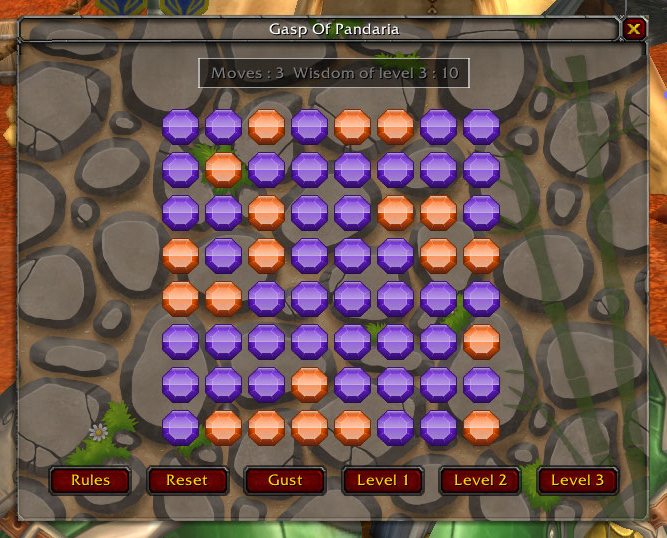
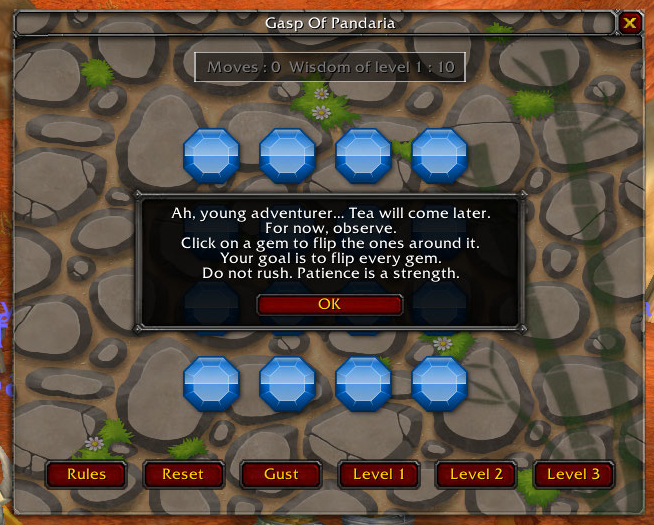
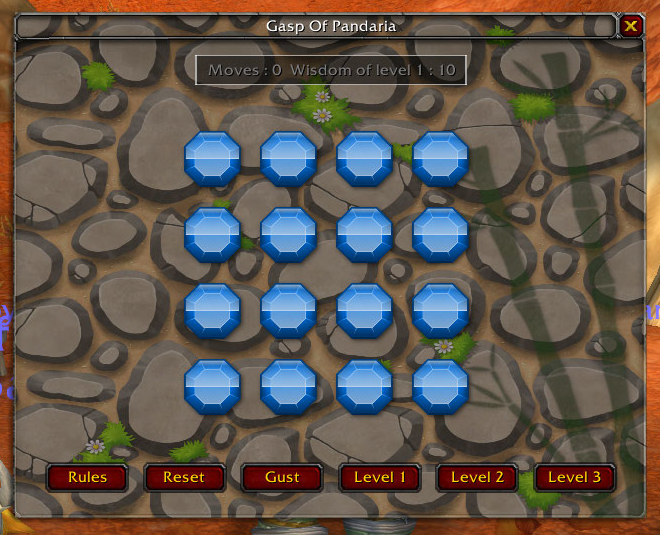
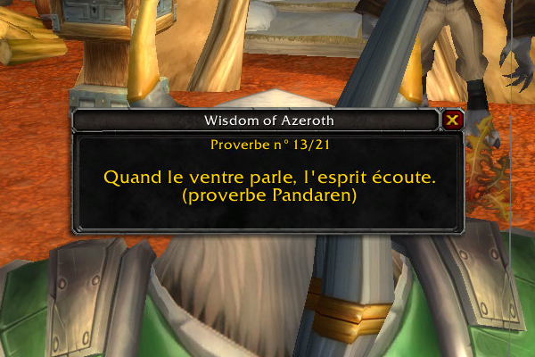
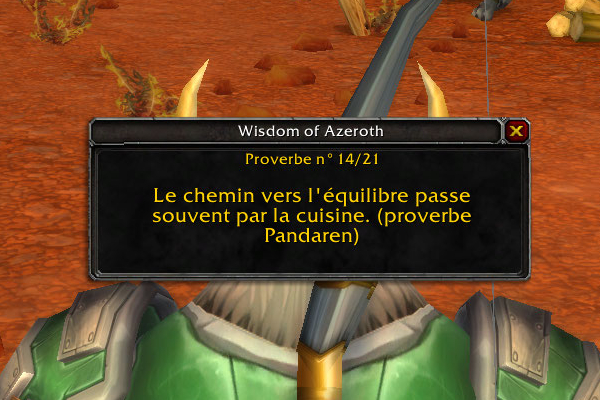
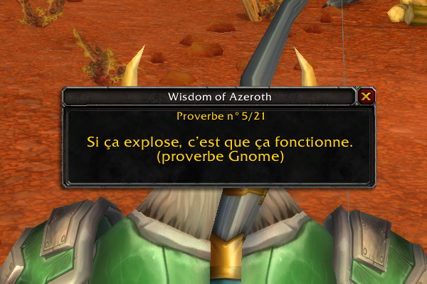

# Addons for World of Warcraft (classic)

## Craft Usage Tooltip

**Craft Usage Tooltip** is a lightweight World of Warcraft addon that displays the professions using an ingredient directly inside the item tooltip.

Get it on CurseForge: https://www.curseforge.com/wow/addons/craft-usage-tooltip

## Gasp Of Pandaria

**Gasp of Pandaria** is a light and relaxing mini‑game inspired by the calm aesthetics of Pandaria. It features a simple 4×4 puzzle grid designed for quick, enjoyable sessions between quests, dungeons, or raids.

  
  
  

Get it on CurseForge: https://www.curseforge.com/wow/addons/gasp-of-pandaria

## Wisdom of Azeroth

**Wisdom of Azeroth** is a lightweight World of Warcraft flavor addon that displays a random Azeroth-themed proverb when you log in.

  
  
  

Get it on CurseForge: https://www.curseforge.com/wow/addons/wisdom-of-azeroth
