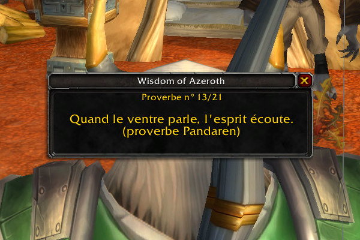
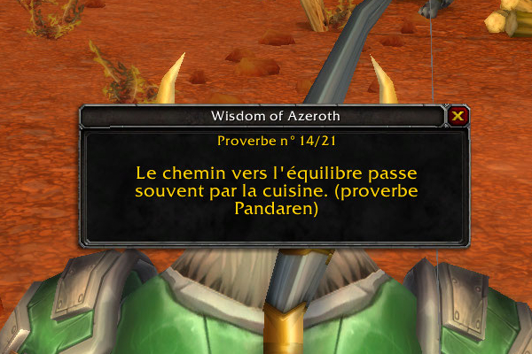
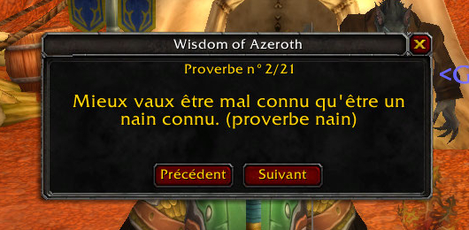

# Addons for World of Warcraft (classic)

**Please note:** Please note: The versions available on GitHub are still under development. They may contain bugs, and some features may not yet be fully functional.

Stable versions are available in the "releases" folder.

## Craft Usage Tooltip

(work in progress)

**Craft Usage Tooltip** is a lightweight World of Warcraft addon that displays the professions using an ingredient directly inside the item tooltip.

Get the stable release on CurseForge: [Craft Usage Tooltip](https://www.curseforge.com/wow/addons/craft-usage-tooltip)

## Gasp Of Pandaria

**Gasp of Pandaria** is a light and relaxing mini‑game inspired by the calm aesthetics of Pandaria. It features a simple 4×4 puzzle grid designed for quick, enjoyable sessions between quests, dungeons, or raids.

  
  
  

Get the stable release on CurseForge: [Gasp of Pandaria](https://www.curseforge.com/wow/addons/gasp-of-pandaria)

## Traveler's Notebook

(work in progress)

While playing World of Warcraft, I often keep a real notebook next to me to write down useful information: NPC locations, quests, ideas, and things I don't want to forget. **Traveler's Notebook** brings this habit directly into the game.

  
  
  

Get the stable release on CurseForge: [Gasp of Pandaria](https://www.curseforge.com/wow/addons/travelers-notebook)

## Wisdom of Azeroth

**Wisdom of Azeroth** is a lightweight World of Warcraft flavor addon that displays a random Azeroth-themed proverb when you log in.

  
  
  

Get the stable release on CurseForge: [Wisdom of Azeroth](https://www.curseforge.com/wow/addons/wisdom-of-azeroth)
