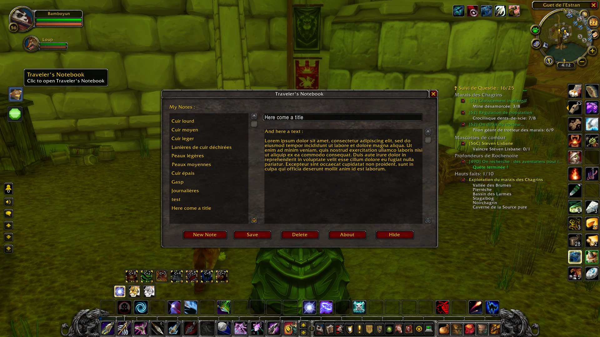

# Traveler's Notebook

While playing World of Warcraft, I often keep a real notebook next to me to write down useful information: NPC locations, quests, ideas, and things I don't want to forget. **Traveler's Notebook** brings this habit directly into the game.

## Development notice

The versions available on GitHub are still under development. They may contain bugs, and some features may not yet be fully functional. Stable versions are available in the "releases" folder.

## The idea behind Traveler's Notebook

Like many adventurers, I used to keep notes on paper while playing World of Warcraft:

* where to find a useful NPC,
* where to gather materials,
* reminders for daily quests,
* personal discoveries during my travels.

Traveler's Notebook is a simple in-game notebook inspired by that habit.
It brings a small, personal journal directly into your WoW interface.

  
  
  

## Assets

- https://opengameart.org/content/stylized-magic-book