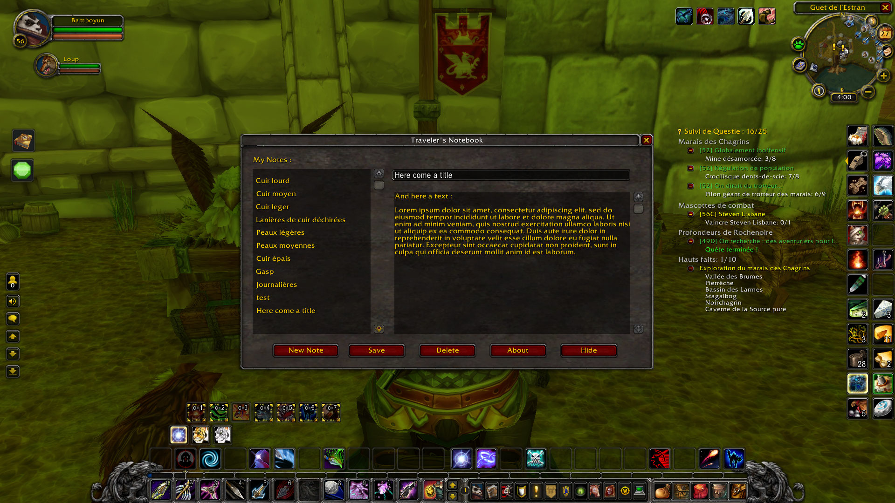
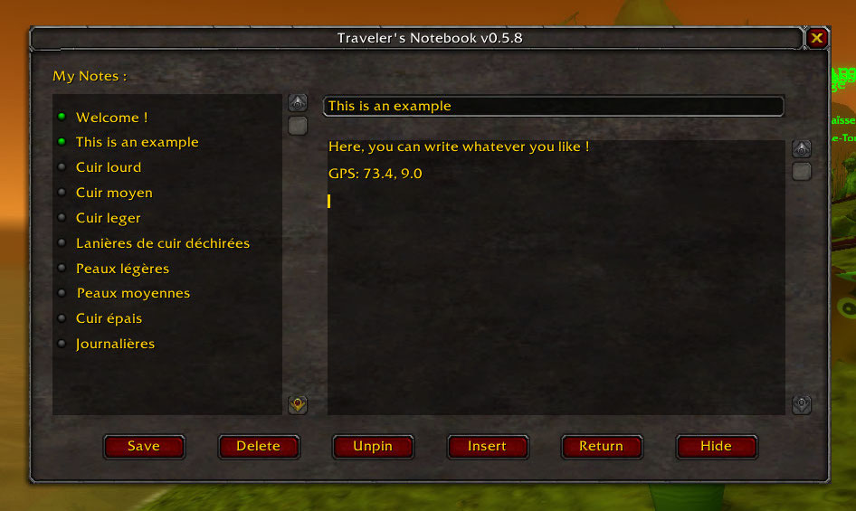
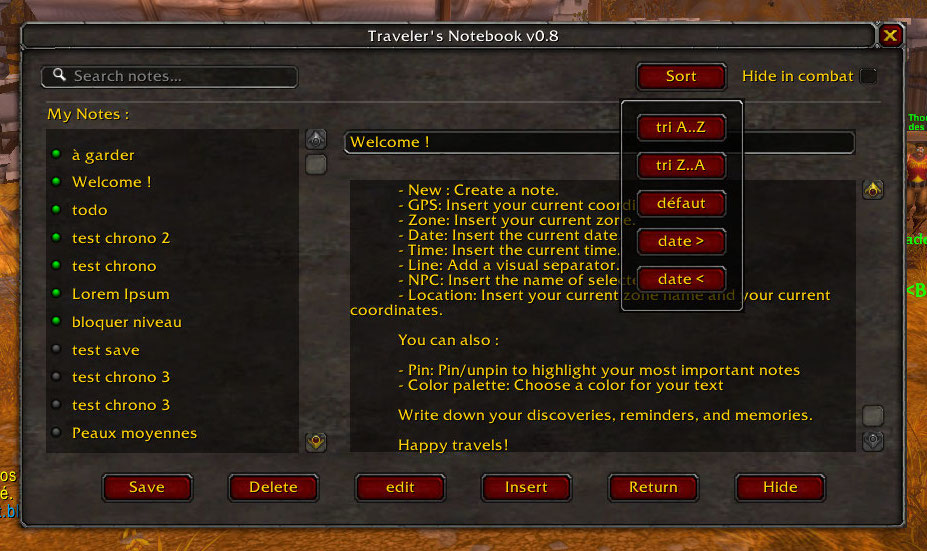

# Traveler's Notebook

While playing World of Warcraft, I often keep a real notebook next to me to write down useful information: NPC locations, quests, ideas, and things I don't want to forget. **Traveler's Notebook** brings this habit directly into the game.

Get the stable release on CurseForge: [Gasp of Pandaria](https://www.curseforge.com/wow/addons/travelers-notebook)

## Development notice

The versions available on GitHub are still under development. They may contain bugs, and some features may not yet be fully functional.

Traveler's Notebook is currently developed and tested for **World of Warcraft: Mists of Pandaria Classic**.

## The idea behind Traveler's Notebook

Like many adventurers, I used to keep notes on paper while playing World of Warcraft:

* where to find a useful NPC,
* where to gather materials,
* reminders for daily quests,
* personal discoveries during my travels.

Traveler's Notebook is a simple in-game notebook inspired by that habit.

It brings a small, personal journal directly into your WoW interface, allowing you to write and enrich your notes without leaving the game.

## Features

  
  
  

### Notebook

* Create and edit personal notes directly in World of Warcraft.
* Save your notes for later use.
* Keep your own travel journal and reminders.

### Insert menu

Traveler's Notebook includes an **Insert** menu to quickly insert useful information into your current note.

Available insertions:

* **GPS** — Insert your current coordinates.
* **Zone** — Insert your current zone name.
* **Date** — Insert the current date.
* **Time** — Insert the current time.
* **Line** — Add a visual separator.
* **NPC** — Insert the name of the selected NPC.
* **Location** — Insert your current zone and coordinates.

More insert options may be added in future versions.

### Edit menu

Traveler's Notebook includes an **Edit** menu.

Available options:

* **Pin** — Pin/unpin to highlight your most important notes
* **Color palette** - Choose a color for your text.

More edit options may be added in future versions.

## Philosophy

Traveler's Notebook is not designed to replace large database addons or quest helpers.

The goal is simple:

> Give players a small personal notebook to record their own adventures.

It is a tool for exploration, memories, and personal notes.

## Assets

- https://opengameart.org/content/stylized-magic-book